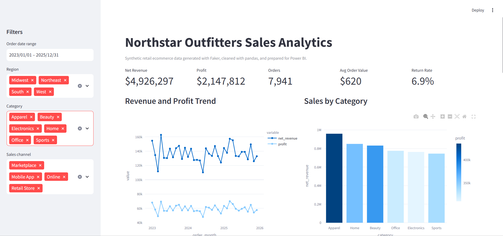

# Retail Sales Analytics Portfolio Project

A portfolio-ready sales data analysis project that demonstrates Python data generation, data cleaning, automated testing, dashboarding, and Power BI business intelligence storytelling.

The project models a fictional retail ecommerce company, **Northstar Outfitters**, using realistic fake data generated with Faker. The data pipeline intentionally creates messy raw data, cleans it with pandas, validates the results with pytest, and exports dashboard-ready CSV files for Streamlit and Power BI.

## Portfolio Skills Demonstrated

- Python project structure
- Faker-based synthetic data generation
- pandas data cleaning and transformation
- data quality validation
- pytest automated testing
- Streamlit dashboard development
- Power BI data modeling and DAX planning
- business-focused analytics storytelling

## Project Structure

```text
sales_data_analysis/
  app.py
  requirements.txt
  pytest.ini
  src/
    config.py
    generate_data.py
    clean_data.py
    validation.py
  tests/
    test_pipeline.py
  data/
    raw/
    cleaned/
  docs/
    data_quality_checks.md
    testing_plan.md
    user_acceptance_testing.md
  powerbi/
    README.md
    powerbi_testing_checklist.md
  reports/
```

## Quick Start

Install dependencies:

```bash
pip install -r requirements.txt
```

On Windows, a project virtual environment is recommended:

```powershell
python -m venv .venv
.\.venv\Scripts\python.exe -m pip install -r requirements.txt
```

Generate raw data:

```bash
python -m src.generate_data
```

Clean and export analytical datasets:

```bash
python -m src.clean_data
```

Run automated tests:

```bash
pytest
```

Launch the dashboard:

```bash
streamlit run app.py
```

Or use the included Windows launcher:

```powershell
powershell.exe -ExecutionPolicy Bypass -File scripts\start_dashboard.ps1
```

## Data Story

Northstar Outfitters sells retail products across US regions and multiple sales channels. The analysis helps answer practical business questions:

- Which categories and products drive revenue and profit?
- How do sales vary by region, channel, and month?
- Which customer segments generate the most value?
- Are discounts improving revenue or hurting margin?
- Where are returns creating business risk?

## Power BI

The cleaned CSV exports in `data/cleaned/` are ready to import into Power BI. The `powerbi/README.md` file includes relationships, DAX measures, dashboard pages, and a visual QA checklist.

## Testing Documents

Testing documentation is included in `docs/` and `powerbi/`:

- `docs/testing_plan.md`
- `docs/data_quality_checks.md`
- `docs/user_acceptance_testing.md`
- `powerbi/powerbi_testing_checklist.md`

## Suggested Portfolio Screenshots

After running the Streamlit app and building the Power BI report, add screenshots to `reports/`:

- executive KPI dashboard

- revenue trend analysis
[streamlit](reports\revenue_profit_trend.png)
- category and product performance
[streamlit](reports/sales_category.png)
- returns and discount analysis
[streamlit](returns_category.png)
- Power BI model view
[powerbi](powerbi/model_view1.png)
[powerbi](model_view2.png)
